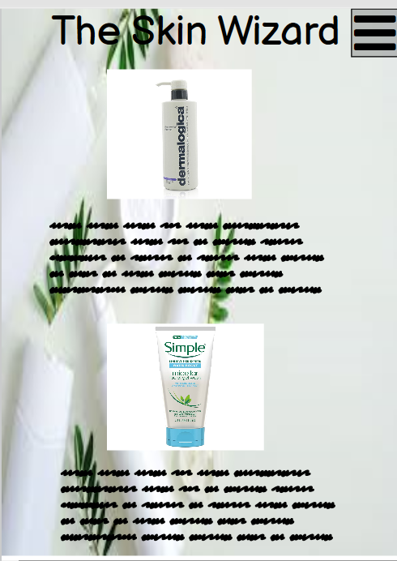
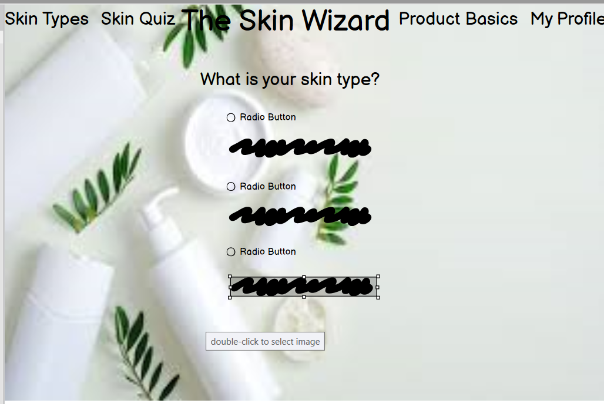
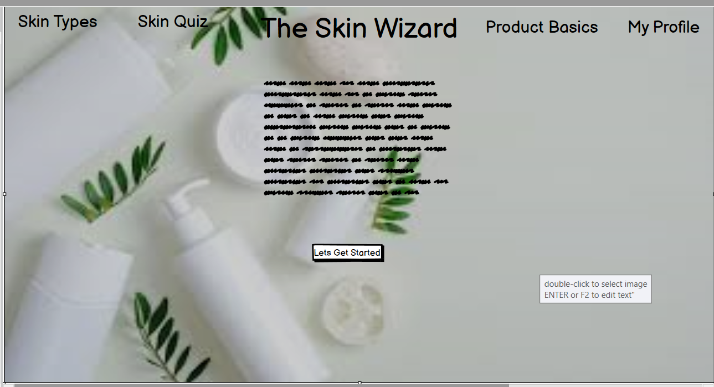

# Skincare Wizard
## Introduction
The aim of this site is to help and educate female users about 
their skin. After a brief introduction to skin types, users will be 
asked to input their age group, followed by a small questionaire about 
their own skin and any issues they may have.
The site will then offer them a product on the high end price and a 
drugstore alternative to suit a lower budget and information regarding each.

### Motivation
The motivation behind this website is to provide education for female users
about skincare. I am a qualified beauty therapist and my experience has shown me that 
a lot of confusion surrounds skincare, there are thousands of products on the market
amd many are using the wrong products for their skin type which can lead to further 
skin issues or making current issues worse. High end brands can be very expensive so the
drugstore alternatives are there to suit lower budgets.

### Future Planning
There are many steps this site can take for the future, mens skincare is just as important and woukd need
to be added, different brands to suit different budgets, skincare brands sections and 
beauty salons/skin clinics could adapt this application to include products they sell.

----
## User Stories (UX)
### Wireframes
- Mobile

- Tablet

- Desktop
